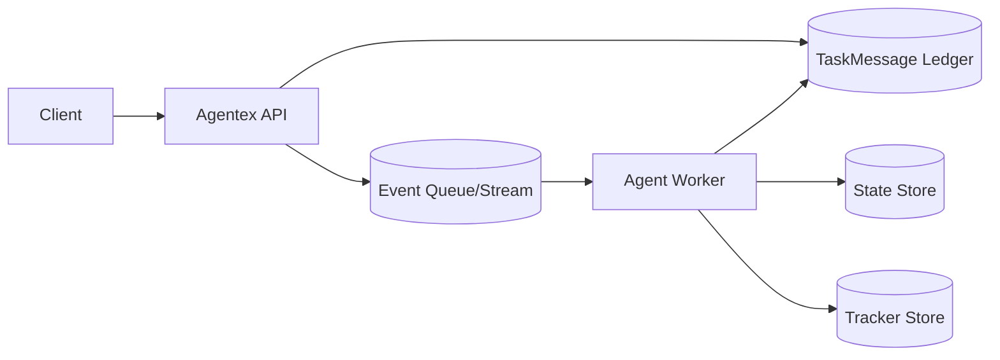
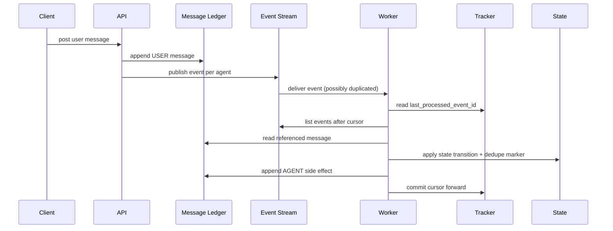

# Exercise 1 Architecture

This file shows the design artifact expected before coding.

## 1. Problem framing

Design a minimal async agent runtime that supports:
1. Durable conversation history.
2. Event-driven processing.
3. Retry-safe processing with cursor checkpointing.
4. Independent per-agent state on the same task.

## 2. Functional requirements

1. Persist USER message to a task ledger.
2. Emit one event per subscribed agent.
3. Agents process unprocessed events and can emit AGENT messages.
4. Cursor (`last_processed_event_id`) advances only after successful processing.
5. Duplicate deliveries must not duplicate side effects.

## 3. Non-functional requirements

1. Correctness:
   - No lost durable USER messages.
   - No duplicated AGENT side effects from retries.
2. Reliability:
   - Recover from worker crash with replay from cursor.
3. Latency:
   - P95 event-to-processing under 2s (example target).
4. Scalability:
   - Horizontal scale across many tasks and agents.
5. Operability:
   - Detect lagging cursors and duplicate-delivery rate quickly.

## 4. System context

## 5. Core sequence

## 6. Data model

1. `TaskMessage`
   - `id`, `task_id`, `author`, `content`, `created_at`
2. `Event`
   - `id`, `task_id`, `agent_id`, `message_id`, `created_at`
3. `AgentTaskTracker`
   - `(task_id, agent_id)`, `last_processed_event_id`, `updated_at`
4. `State`
   - `(task_id, agent_id)`, `state_json`, `version`
   - includes dedupe set `processed_event_ids`

## 7. API contracts (conceptual)

1. `post_user_message(task_id, text) -> message_id`
2. `list_events(task_id, agent_id, after_event_id) -> Event[]`
3. `process_with_cursor(task_id, agent_id, delivered_event_id) -> processed_count`
4. `get_state(task_id, agent_id) -> state`

## 8. Scaling strategy

1. Partitioning:
   - Route work by `(task_id, agent_id)` key for state locality.
2. Read/write scaling:
   - Message ledger append-only.
   - Event stream partitioned by task key.
3. Backpressure:
   - Per-partition max in-flight events.
   - Retry with exponential backoff for transient failures.
4. Hot task mitigation:
   - Rate limits or task-level worker isolation.

## 9. Failure modes and mitigations

1. Crash after side effect before cursor commit:
   - Mitigation: dedupe set, idempotent state transition, replay from old cursor.
2. Duplicate event delivery:
   - Mitigation: check `processed_event_ids` before side effects.
3. Cursor regression bug:
   - Mitigation: enforce forward-only update.
4. Poison event repeatedly failing:
   - Mitigation: dead letter queue and alerting.

## 10. Observability

1. Metrics:
   - `events_received_total`
   - `events_processed_total`
   - `events_skipped_duplicate_total`
   - `cursor_lag_events`
   - `processing_latency_ms`
2. Logs:
   - include `task_id`, `agent_id`, `event_id`, `message_id`, `cursor_before`, `cursor_after`.
3. Tracing:
   - span across event receive -> message read -> state update -> cursor commit.

## 11. ADR decisions

1. Choose at-least-once + idempotency over exactly-once transport complexity.
2. Choose per-agent state isolation over shared global state.
3. Choose cursor-committed batch progress over per-event commit for simpler recovery.

## 12. Review checklist

1. Can any path lose a USER message after API success?
2. Can retries produce duplicate AGENT outputs?
3. Can cursor move forward without side effects being complete?
4. Are agent states isolated by `(task_id, agent_id)`?
5. Are lag and duplicate rates observable in production?

