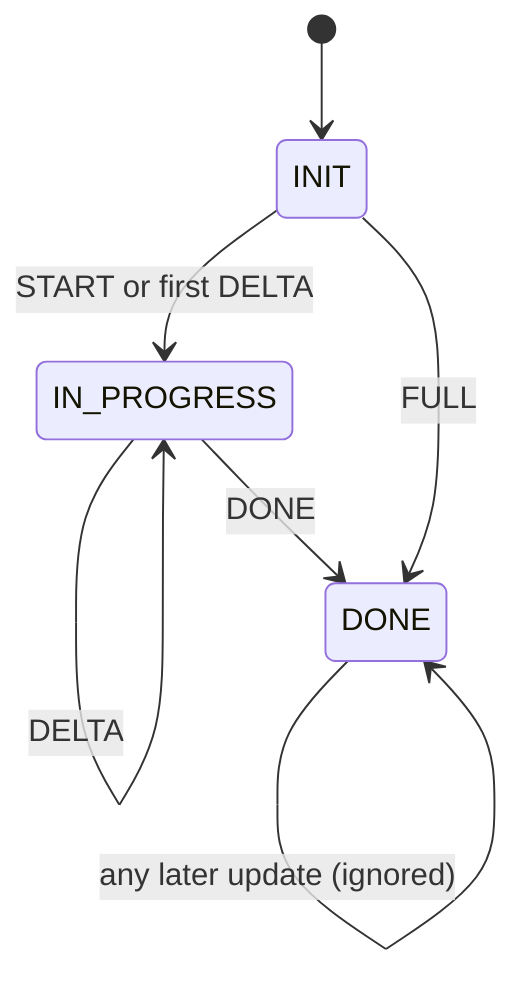
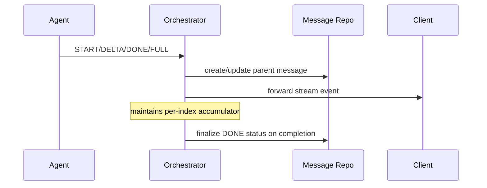

# Exercise 2 Architecture: Streaming + Durable Persistence

## 1. Problem statement

Design a streaming orchestrator that:
1. forwards low-latency chunk updates to clients, and
2. produces durable final task messages that can be reloaded after refresh.

## 2. Functional requirements

1. Support update types: `START`, `DELTA`, `DONE`, `FULL`.
2. Support multiple parallel message indexes in one stream.
3. Maintain one parent durable message per `(task_id, index)`.
4. Final persisted record must be `"DONE"` when stream segment completes.
5. Ignore updates for indexes already completed.

## 3. Non-functional requirements

1. Correctness:
   - no duplicate durable records per index
   - deterministic final content after retries
2. Latency:
   - stream forwarding should not wait for heavy post-processing
3. Reliability:
   - crash mid-stream should not corrupt persisted status
4. Operability:
   - observability of stuck in-progress streams

## 4. Key invariants

1. Parent identity invariant:
   - each index has at most one durable parent message id.
2. Completion invariant:
   - if index is completed, persisted status is `"DONE"`.
3. Accumulator invariant:
   - deltas for one index only affect that index.

## 5. State machine

## 6. Sequence

## 7. Scaling model

1. Partition by `(task_id, index)` for accumulator and message ownership.
2. Keep accumulator in memory for hot path, but flush to durable store on done.
3. Apply bounded memory policy for long-running streams.

## 8. Failure handling rules

1. Delta-before-start:
   - synthesize start internally, create parent once, continue.
2. Duplicate done/full:
   - ignore after completion.
3. Stream abort:
   - flush what is accumulated at end-of-stream, mark done if policy requires.

## 9. Observability

1. Metrics:
   - `stream_chunks_total`
   - `streams_completed_total`
   - `synthesized_start_total`
   - `duplicate_chunk_ignored_total`
2. Alerts:
   - indexes stuck `"IN_PROGRESS"` beyond timeout.

## 10. Definitive design decisions

1. Choose per-index state machine to avoid cross-index interference.
2. Choose explicit completion set to enforce idempotency.
3. Choose durable parent record creation early to attach all updates consistently.

